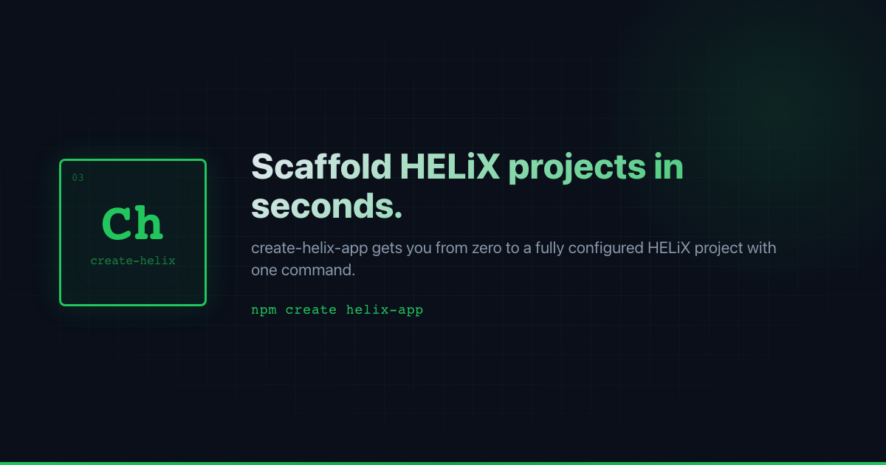

<div align="center">



# create-helix

[](https://www.npmjs.com/package/create-helix)
[](https://github.com/bookedsolidtech/create-helix-app/actions)
[](https://github.com/bookedsolidtech/create-helix-app/actions)
[](LICENSE)
[](https://nodejs.org)
[](tsconfig.json)

</div>

Scaffold a new project with [HELiX](https://github.com/bookedsolidtech/helix) enterprise web components. TUI-powered CLI with support for 9 framework targets and 4 Drupal presets.

## Quick Start

```bash
npx create-helix
# or
npm create helix
```

Follow the interactive prompts to choose your framework, component bundles, and features.

### Drupal Theme Scaffolding

```bash
npx create-helix --drupal
```

Or pass a preset directly:

```bash
npx create-helix --drupal --preset healthcare
```

## Supported Frameworks

| Framework                | Command Hint                 | Features                                               |
| ------------------------ | ---------------------------- | ------------------------------------------------------ |
| **React + Next.js 16**   | recommended for new projects | SSR, App Router, React wrappers                        |
| **React + Vite**         | best DX for SPAs             | Hot reload, React wrappers                             |
| **Remix**                | full-stack React, SSR        | SSR, nested routes, React wrappers                     |
| **Vue + Nuxt 4**         | Vue ecosystem, SSR built-in  | SSR, native WC support, auto-imports                   |
| **Vue + Vite**           | minimal, fast                | Hot reload, native WC support                          |
| **SvelteKit**            | best native WC support       | SSR, native WC support, Runes                          |
| **Angular 18**           | enterprise teams             | Signals, standalone components, CUSTOM_ELEMENTS_SCHEMA |
| **Astro**                | docs sites, marketing        | Islands architecture, zero JS by default               |
| **Vanilla (HTML + CDN)** | prototyping, Drupal, CMS     | Zero config, CDN, no build step                        |

## Drupal Presets

| Preset       | Description                                         | SDC Count |
| ------------ | --------------------------------------------------- | --------- |
| `standard`   | Core Drupal SDCs for general-purpose themes         | 7         |
| `blog`       | Standard + blog-specific content components         | 12        |
| `healthcare` | Blog + healthcare-specific components (HIPAA-aware) | 16        |
| `intranet`   | Standard + employee portal components               | 11        |

Each preset generates a complete Drupal theme directory with:

- Theme info and libraries YAML files
- Single Directory Components (SDCs) with Twig templates
- HELiX component CDN integration via `helixui.libraries.yml`
- Drupal behaviors using the `once()` pattern
- `composer.json` and `package.json`

See [docs/drupal-presets.md](./docs/drupal-presets.md) for full details.

## Component Bundles

When scaffolding a framework project, you can select which component bundles to include:

| Bundle                  | Components | Description                                                  |
| ----------------------- | ---------- | ------------------------------------------------------------ |
| **All Components**      | 98         | The full HELiX library                                       |
| **Core UI**             | 14         | button, card, badge, text, icon, avatar, divider, chip       |
| **Form Components**     | 16         | text-input, select, checkbox, radio, switch, textarea, field |
| **Navigation**          | 12         | nav, sidebar, tabs, breadcrumb, pagination, menu             |
| **Data Display**        | 10         | data-table, stat, progress, meter, counter, structured-list  |
| **Feedback & Overlays** | 8          | alert, toast, dialog, drawer, banner, skeleton               |
| **Layout**              | 11         | grid, stack, split-panel, accordion, carousel                |

## Additional Features

- **TypeScript** -- strict mode configuration
- **ESLint + Prettier** -- code quality and formatting
- **HELiX Design Tokens** -- CSS custom properties for theming
- **Dark Mode Support** -- automatic dark mode via `prefers-color-scheme`
- **Example Pages** -- forms, dashboard, and settings page examples

## Requirements

- Node.js >= 20.0.0

## Development

```bash
git clone https://github.com/bookedsolidtech/create-helix-app.git
cd create-helix-app
npm install
npm run build
```

### Scripts

| Script                 | Description                      |
| ---------------------- | -------------------------------- |
| `npm run build`        | Compile TypeScript               |
| `npm run dev`          | Watch mode                       |
| `npm start`            | Run the CLI                      |
| `npm run type-check`   | TypeScript strict check          |
| `npm run lint`         | ESLint                           |
| `npm run format`       | Prettier auto-fix                |
| `npm run format:check` | Prettier check                   |
| `npm test`             | Run tests                        |
| `npm run verify`       | lint + format:check + type-check |
| `npm run preflight`    | verify + test                    |

## Contributing

1. Fork the repo and create a feature branch
2. Make your changes
3. Run `npm run verify` before pushing (enforced by pre-push hook)
4. Run `npm test` to ensure all tests pass
5. Open a pull request against `dev`

### Secret Scanning

This repo uses [gitleaks](https://github.com/gitleaks/gitleaks) to prevent secrets from being committed. Install it locally to enable pre-commit scanning:

```bash
# macOS
brew install gitleaks

# Linux
GITLEAKS_VERSION="8.21.2"
curl -sSfL \
  "https://github.com/gitleaks/gitleaks/releases/download/v${GITLEAKS_VERSION}/gitleaks_${GITLEAKS_VERSION}_linux_x64.tar.gz" \
  | tar -xz -C ~/.local/bin gitleaks

# Windows (via scoop)
scoop install gitleaks
```

If gitleaks is not installed, the pre-commit hook will warn but will not block your commit. CI always runs the full scan. Configuration is in `.gitleaks.toml`.

## License

[MIT](./LICENSE) -- Copyright 2026 BookedSolid Tech
