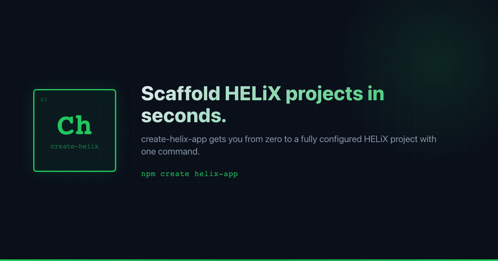

<div align="center">



# create-helix

[](https://www.npmjs.com/package/create-helix)
[](https://github.com/bookedsolidtech/create-helix-app/actions)
[](LICENSE)
[](https://nodejs.org)
[](tsconfig.json)

</div>

Scaffold a HELiX design system project in seconds. TUI-powered CLI with a **two-step starter-kit picker** — first you tell it what the project builds (`wc-storybook` design system, `react-next` app, `react-vite` app, or `drupal-theme`), then it offers to bundle a shared `design-system` package alongside. 11 additional experimental frameworks are available behind `--show-experimental`.

**New in v0.9.0 — SvelteKit joins the production-tier starter kits.** The Q1 picker now offers five production-tier targets: `wc-storybook`, `react-next`, `react-vite`, `astro`, and **`svelte-kit`**. The SvelteKit starter ships a real SvelteKit 2 + Svelte 5 landing page on `adapter-static` (hero, features, showcase, browser-native View Transitions via `onNavigate`, theme toggle, two routed pages) and consumes the design system as `<hx-*>` web components natively — Svelte 5's compiler treats unknown lowercase-with-dash tags as DOM elements first-class, no `isCustomElement` config needed. Visual baselines ship under [`tests/e2e/screenshots/sveltekit/`](./tests/e2e/screenshots/sveltekit/).

**v0.8.0 — Astro joined the production tier** with a real Astro 5 landing page (hero, features, view transitions, theme toggle, two routed pages) consuming the design system as `<hx-*>` web components natively. Baselines under [`tests/e2e/screenshots/astro/`](./tests/e2e/screenshots/astro/).

**v0.7.0 introduced monorepo by default for app frameworks.** When you pick `react-next`, `react-vite`, `astro`, or `svelte-kit` and keep the design system (the default Y at Q2), `create-helix` emits a **turbo + pnpm-workspaces monorepo** with `apps/web/` + `packages/{design-system,types,utils}/` — modeled on the shadcn `apps/web` + `packages/ui` precedent. Pass `--no-design-system` (or answer "n" at Q2) to keep the v0.6.x flat single-app shape. See [Monorepo by default](#monorepo-by-default-v070) and [`MIGRATING.md`](./MIGRATING.md).

The flagship `wc-storybook` template remains the default interactive selection and ships a brand-storytelling Storybook experience out of the box — Cover narrative, foundations IA (including a v0.6.0 Iconography page wired to `@helixui/icons`), per-component AAA conformance pages with auto-injected accessibility status cards, and a token-driven manager chrome that follows your brand. See [WC-Storybook brand-storytelling experience](#wc-storybook-brand-storytelling-experience) below.

## Quick Start

```bash
npx create-helix
# or
npm create helix
```

Follow the interactive prompts to choose your framework, component bundles, and features.

### Drupal Theme Scaffolding

```bash
npx create-helix --drupal
```

Or pass a preset directly:

```bash
npx create-helix --drupal --preset healthcare
```

## Supported Frameworks

The interactive prompt shows a curated slim list by default — the flagship `wc-storybook` factory plus the four production-tier app starters that have shipped beyond stub quality. The remaining 11 framework templates exist but are gated behind `--show-experimental` until they reach the same bar.

| Framework                      | Command Hint                        | Features                                                                                                          |
| ------------------------------ | ----------------------------------- | ----------------------------------------------------------------------------------------------------------------- |
| **WC Storybook (factory)**     | default — design system factory     | Lit 3, Storybook 10, brand-storytelling docs, AAA cards, Iconography page, auto-catalog ~99 hx-\* entries         |
| **React + Next.js 16**         | recommended for new app projects    | SSR, App Router, React wrappers                                                                                   |
| **React + Vite**               | best DX for SPAs                    | Hot reload, React wrappers, production landing page                                                               |
| **Astro 5**                    | islands + native web components     | Landing page, view transitions, theme toggle, native `<hx-*>` consumption, Playwright visual baseline             |
| **SvelteKit 2** _(new v0.9.0)_ | static-site + native web components | Landing page, browser-native View Transitions API, theme toggle, native `<hx-*>` consumption, Playwright baseline |

### Experimental templates

Run `npx create-helix --show-experimental` (or set `HELIX_SHOW_EXPERIMENTAL=1`) to surface these in the prompt, the `list` subcommand, and as valid `--template <name>` values:

`remix`, `vue-nuxt`, `vue-vite`, `angular`, `lit-vite`, `solid-vite`, `qwik-vite`, `preact-vite`, `stencil`, `ember`, `vanilla`

These templates compile and emit a project skeleton, but their docs / examples / DX polish lag behind the curated five. They'll graduate out of `--show-experimental` as they reach the same bar.

## Monorepo by default (v0.7.0+)

When you pick an app framework (`react-next`, `react-vite`, `astro`, or **`svelte-kit`** as of v0.9.0) and keep the design system at the second prompt — the **default Y** — `create-helix` emits a turbo + pnpm-workspaces monorepo:

```
my-project/
├── apps/
│   └── web/                # Next.js, Vite, Astro, or SvelteKit app
├── packages/
│   ├── design-system/      # Lit web components + Storybook
│   ├── types/              # Shared TS types + brand utilities
│   └── utils/              # Shared helpers (cn, isPresent, …)
├── pnpm-workspace.yaml
├── turbo.json
├── tsconfig.base.json
└── package.json
```

`apps/web` declares the workspace packages via `workspace:*` deps. The framework-specific wiring per starter kit:

- **Next.js** carries `transpilePackages` + `experimental.externalDir`; the design system is consumed via generated React wrappers from `packages/design-system/src/react.ts`.
- **Vite** carries `optimizeDeps.exclude` + `server.fs.allow: ['..', '../..']`; React wrappers as with Next.
- **Astro (v0.8.0)** consumes the design system as **`<hx-*>` web components natively** — no React wrappers, no `createComponent` indirection — because Astro's island architecture is web-component-first.
- **SvelteKit (v0.9.0)** also consumes the design system as **`<hx-*>` web components natively** — Svelte 5's compiler treats unknown lowercase-with-dash tags as DOM elements first-class (no `isCustomElement` config required). `adapter-static` output; browser-native View Transitions wired via `onNavigate`; `apps/web/vite.config.ts` carries the same `optimizeDeps.exclude` + `server.fs.allow` wiring.

Running `pnpm dev` at the root runs `turbo run dev`, which boots both `apps/web` and `packages/design-system` Storybook (port 6006) concurrently. Default app ports: **Next.js 3000**, **Vite 5173**, **Astro 4321**, **SvelteKit 5173**.

The shape mirrors the [shadcn `apps/web` + `packages/ui` monorepo precedent](https://github.com/shadcn-ui/ui/tree/main/apps/www) — proven at scale, familiar to consumers.

### Available starter-kit combinations

After Q1 (what does this project build?) and Q2 (include design system?), the supported combinations are:

- **Design system** (`wc-storybook`, flat — always flat, it _is_ the design system)
- **Next.js + design system** (monorepo, default for Next pick)
- **Vite + design system** (monorepo, default for Vite pick)
- **Astro + design system** _(v0.8.0)_ — monorepo, default for Astro pick
- **SvelteKit + design system** _(new v0.9.0)_ — monorepo, default for SvelteKit pick

### Opting out

Three escape valves keep the v0.6.x flat single-app shape available:

- **Interactive** — answer "n" at the "Include design-system package?" prompt.
- **CLI flag** — pass `--no-design-system` (or `--monorepo=false`).
- **API** — `scaffold({ framework: 'react-next' | 'react-vite' | 'astro', monorepoMode: false })`.

`wc-storybook` always scaffolds flat — it is itself the design system, so wrapping it in a monorepo would duplicate the layer.

**The flat Astro path is deprecated as of v0.8.0** — still reachable via the API + `--no-design-system` for back-compat, but the monorepo is now the supported shipping target. New Astro investment lands in the monorepo emit. See [`MIGRATING.md`](./MIGRATING.md) v0.7 → v0.8 section.

**Existing v0.5.x / v0.6.x / v0.7.x scaffolds are not broken.** Their shape on disk is unchanged. A `create-helix migrate-to-monorepo` subcommand is deferred; see [`MIGRATING.md`](./MIGRATING.md) for the manual recipe (which covers Next/Vite/Astro alike — they share the same workspace shape).

### Cross-kit feature parity (v0.9.1+)

The 4 production kits (react-next, react-vite, astro, svelte-kit) share a deliberately consistent consumer surface so a developer moving between them recognizes the shape:

| Feature                                       | react-next                           | react-vite              | astro                       | svelte-kit          |
| --------------------------------------------- | ------------------------------------ | ----------------------- | --------------------------- | ------------------- |
| `<h1>`                                        | "Build interfaces on web standards." | same                    | same                        | same                |
| `<title>`                                     | `{name} — built with create-helix`   | same                    | same                        | same                |
| Theme toggle                                  | native `<button>` w/ `aria-label`    | same                    | same                        | same                |
| `localStorage` key                            | `helix-theme`                        | same                    | same                        | same                |
| Pre-hydration boot script                     | inline `<script>`                    | `/public/theme-boot.js` | inline `<script is:inline>` | inline `<script>`   |
| Pre-hydration `prefers-color-scheme` fallback | yes                                  | yes                     | yes                         | yes                 |
| `<main>` landmark                             | per-page (exactly 1)                 | in App.tsx              | in Layout                   | in `+layout.svelte` |
| Hero CTAs                                     | styled `<a class="button">`          | same                    | same                        | same                |
| `<hx-*>` consumption                          | `@lit/react` wrappers                | `@lit/react` wrappers   | native                      | native              |

What's intentionally platform-specific:

- **App structure** — App Router multi-route (Next), SPA (Vite), static + ClientRouter (Astro), file-based routing (SvelteKit).
- **View transitions** — Astro's `<ClientRouter />` and SvelteKit's `onNavigate` + browser-native View Transitions API. React kits don't get these for free.
- **Build artifacts** — `.next/`, `dist/`, `dist/` (astro), `build/` + `.svelte-kit/`.

What's deferred to upstream:

- `<hx-select>` placeholder color contrast (`#94a3b8` on white = 2.56:1) — single remaining axe-core violation across all 8 default page-visits. Tracked in the BST `Helix Bug Reports.md` vault doc.

## WC-Storybook brand-storytelling experience

`npx create-helix` → choose **WC Storybook (factory)** to scaffold a Lit 3 design system with a fully-staged Storybook out of the box. Three brand prompts shape the experience:

- **Design system codename** (`--ds-name`) — drives element prefix (`{ds}-button`) and CSS token namespace (`{prefix}-*`).
- **Brand tagline** (`--brand-tagline`) — surfaces in `Cover.mdx` and `Brand.mdx`. Falls back to a neutral default.
- **Brand verticals** (`--brand-verticals "fintech,wellness"`) — populates the brand toolbar dropdown. Empty = single-brand mode.

The scaffolded Storybook ships:

- **Cover.mdx** with brand tagline + vertical chips + quick-start commands.
- **Overview.mdx** explaining the three-tier token cascade (primitive → semantic → component).
- **Foundations** — 8 MDX pages: Tokens, Color, Typography, Spacing, Layout, Brand, Accessibility, **Iconography** (new in v0.6.0 — renders the full `@helixui/icons` catalog plus a curated showcase, wired to `setBasePath('/icons')` and the `@helixui/icons/dist` static dir). All live-bound to the consumer's `var({prefix}-*)` tokens.
- **Token deep-dives** — dedicated `Foundations/Tokens/Borders` and `Foundations/Tokens/Shadows` pages with live swatches, plus a `Foundations/Tokens/Playground` story for interactive token inspection.
- **Per-component AAA conformance pages** — 8 hand-authored MDXes (button, card, checkbox, dialog, form, select, tabs, text-input) parameterized by `{dsName}` so `<aurora-card>`, `<aurora-form>` etc. render the consumer's tags. Each ships hero scenarios + auto-injected `A11yStatusCard` reading from CEM `helixMeta.aaa.*` + APG pattern card + consumer obligations.
- **Accessibility narrative** — top-level `Accessibility/*` namespace with 8 pages: Dashboard, AAA Story Template, Keyboard Contracts, Success Criteria, Consumer Obligations, Focus Management, Contrast Deep-Dive, Forced Colors. Editorial content modeled on HELiX's own Storybook depth.
- **Scene stories** — 3 cross-domain-neutral pattern playgrounds (`Account Setup`, `Team Dashboard`, `Settings`) demonstrating composition of multiple components in real flows.
- **React helper components** — `TokenSwatchGrid`, `ContrastMatrix`, `RatioCard`, `CodeBlock`, `CodeTabs`, plus `useResolvedToken` hook and APCA `contrast` util. Available under `src/stories/_components/` for consumers to compose their own MDXes.
- **`InlineAuditPanel` opt-in pattern** — ships as a no-op stub by default. Consumers wire their own `markdown` prop to surface per-component AAA-AUDIT content (the audit source lives inside the HELiX monorepo and isn't published; see `docs/FOLLOW-UP-shared-storybook-kit.md` for the trigger conditions that would make this live).
- **Token-driven manager chrome** — light / dark / high-contrast modes via `@helixui/tokens`. FOUC-prevention sync scripts so dark/HC pages don't flash white on reload.
- **Brand toolbar** + persistence via `localStorage["helix:storybook:globals"]`.
- **8 Storybook addons** — a11y, docs, themes, vitest, designs, links, pseudo-states, chromatic-com.
- **`helix.storybook.config.ts`** at the consumer root — opt out of components / docs pages / brand verticals / AAA / narrative pages without diving into `.storybook/`.
- **Auto-catalog on install** (v0.6.0) — when scaffolding with `--install-deps` (default), `pnpm cem:catalog` runs immediately after `pnpm install` so the ~99-entry hx-\* catalog sidebar (atoms / molecules / organisms) is populated on first `pnpm storybook` boot. If you used `--no-install`, the Next-steps banner explicitly lists `pnpm install && pnpm cem:catalog` so the catalog populates before first boot.

## Drupal Presets

| Preset       | Description                                         | SDC Count |
| ------------ | --------------------------------------------------- | --------- |
| `standard`   | Core Drupal SDCs for general-purpose themes         | 7         |
| `blog`       | Standard + blog-specific content components         | 12        |
| `healthcare` | Blog + healthcare-specific components (HIPAA-aware) | 16        |
| `intranet`   | Standard + employee portal components               | 11        |

Each preset generates a complete Drupal theme directory with:

- Theme info and libraries YAML files
- Single Directory Components (SDCs) with Twig templates
- HELiX component CDN integration via `helixui.libraries.yml`
- Drupal behaviors using the `once()` pattern
- `composer.json` and `package.json`

See [docs/drupal-presets.md](./docs/drupal-presets.md) for full details.

## Component Bundles

When scaffolding a framework project, you can select which component bundles to include:

| Bundle                  | Components | Description                                                  |
| ----------------------- | ---------- | ------------------------------------------------------------ |
| **All Components**      | 98         | The full HELiX library                                       |
| **Core UI**             | 14         | button, card, badge, text, icon, avatar, divider, chip       |
| **Form Components**     | 16         | text-input, select, checkbox, radio, switch, textarea, field |
| **Navigation**          | 12         | nav, sidebar, tabs, breadcrumb, pagination, menu             |
| **Data Display**        | 10         | data-table, stat, progress, meter, counter, structured-list  |
| **Feedback & Overlays** | 8          | alert, toast, dialog, drawer, banner, skeleton               |
| **Layout**              | 11         | grid, stack, split-panel, accordion, carousel                |

## Additional Features

- **TypeScript** -- strict mode configuration
- **ESLint + Prettier** -- code quality and formatting
- **HELiX Design Tokens** -- CSS custom properties for theming
- **Dark Mode Support** -- automatic dark mode via `prefers-color-scheme`
- **Example Pages** -- forms, dashboard, and settings page examples

## Roadmap & Migration

- **Migrating from v0.6.x → v0.7.0** — see [MIGRATING.md](./MIGRATING.md). Existing flat scaffolds keep working; the new monorepo shape is opt-in via the second prompt (or `--monorepo`). A manual flat → monorepo recipe is included for early adopters who want to convert.
- **`create-helix migrate-to-monorepo` subcommand** — deferred to **v0.7.1**. Will automate the manual recipe in MIGRATING.md.
- **Publishable design-system package** — deferred. v0.7.0 emits `packages/design-system` as a workspace-internal package only; publishing it standalone to npm needs additional wiring (build pipeline, narrowed peer deps).
- **npm / yarn workspace support** — not on the v0.7.x roadmap. v0.7.0 is pnpm-only (`pnpm-workspace.yaml` + `workspace:*`).
- **`@helixui/storybook-kit` shared package extraction** — deferred. See [docs/FOLLOW-UP-shared-storybook-kit.md](./docs/FOLLOW-UP-shared-storybook-kit.md) for trigger conditions and scope sketch. Today's wc-storybook factory ports helix's Storybook depth at scaffold time; a future iteration may consume a shared kit instead.

## Requirements

- Node.js >= 22.0.0

## Development

```bash
git clone https://github.com/bookedsolidtech/create-helix-app.git
cd create-helix-app
npm install
npm run build
```

### Scripts

| Script                 | Description                      |
| ---------------------- | -------------------------------- |
| `npm run build`        | Compile TypeScript               |
| `npm run dev`          | Watch mode                       |
| `npm start`            | Run the CLI                      |
| `npm run type-check`   | TypeScript strict check          |
| `npm run lint`         | ESLint                           |
| `npm run format`       | Prettier auto-fix                |
| `npm run format:check` | Prettier check                   |
| `npm test`             | Run tests                        |
| `npm run verify`       | lint + format:check + type-check |
| `npm run preflight`    | verify + test                    |

## Contributing

1. Fork the repo and create a feature branch
2. Make your changes
3. Run `npm run verify` before pushing (enforced by pre-push hook)
4. Run `npm test` to ensure all tests pass
5. Open a pull request against `dev`

### Secret Scanning

This repo uses [gitleaks](https://github.com/gitleaks/gitleaks) to prevent secrets from being committed. Install it locally to enable pre-commit scanning:

```bash
# macOS
brew install gitleaks

# Linux
GITLEAKS_VERSION="8.21.2"
curl -sSfL \
  "https://github.com/gitleaks/gitleaks/releases/download/v${GITLEAKS_VERSION}/gitleaks_${GITLEAKS_VERSION}_linux_x64.tar.gz" \
  | tar -xz -C ~/.local/bin gitleaks

# Windows (via scoop)
scoop install gitleaks
```

If gitleaks is not installed, the pre-commit hook will warn but will not block your commit. CI always runs the full scan. Configuration is in `.gitleaks.toml`.

## License

[MIT](./LICENSE) -- Copyright 2026 BookedSolid Tech
